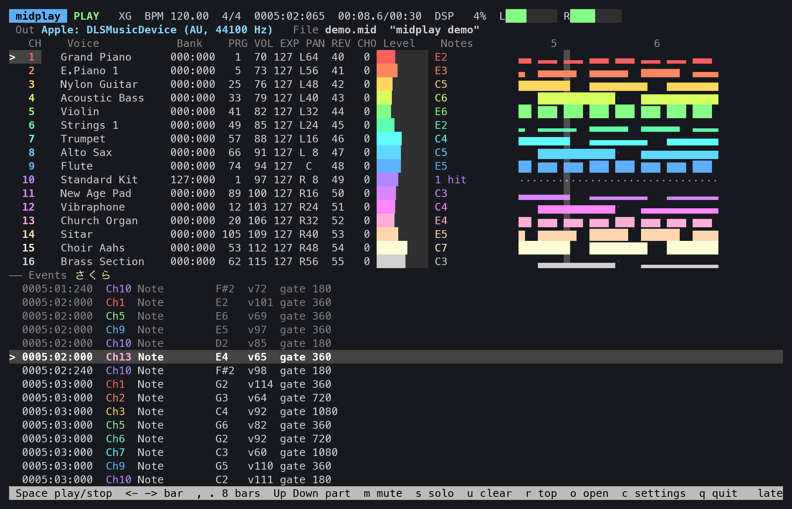

# midplay

English | [日本語](README.ja.md)

A Standard MIDI File player for the macOS and Linux terminal. It plays through a software synth (on the
default audio output) or sends to a MIDI destination (a MIDI device or another program), and shows the
state of the 16 parts, a piano roll and the event list.



| | Software synth (`AU` / `SF2` in `midplay list`) | MIDI destination (`MIDI`) |
|---|---|---|
| macOS | Audio Unit instruments (`au:MANU/SUBT`) | CoreMIDI destinations (MIDI devices, the IAC bus, other apps) |
| Linux | FluidSynth + a SoundFont (`sf:/path/to/file.sf2`) | ALSA sequencer ports (MIDI devices, daemons such as FluidSynth / TiMidity++) |

## Install

Homebrew (macOS arm64, Linux arm64 / amd64):

```sh
brew install mikuta0407/apps/midplay
```

Or unpack a prebuilt binary from [Releases](https://github.com/mikuta0407/midplay/releases) and put
`midplay` somewhere on your `PATH`.

- macOS: nothing else is needed. If you downloaded it with a browser, clear the quarantine attribute with
  `xattr -d com.apple.quarantine midplay`.
- Linux: needs the ALSA and FluidSynth libraries and a SoundFont at run time (glibc 2.34 or later: Ubuntu
  22.04 / Debian 12 or later). On Debian/Ubuntu: `sudo apt install libasound2 libfluidsynth3 fluid-soundfont-gm`
  (`libasound2t64` on Ubuntu 24.04 and later).

## Build

```sh
make                 # build/midplay
make install         # ~/.local/bin/midplay (change with PREFIX=...)
```

- macOS: needs Xcode or the Command Line Tools. The only dependencies are macOS's AudioToolbox / CoreAudio /
  CoreMIDI / CoreFoundation / libiconv.
- Linux: needs a C compiler, pkg-config, and the ALSA and FluidSynth development packages.
  On Debian/Ubuntu: `sudo apt install build-essential pkg-config libasound2-dev libfluidsynth-dev fluid-soundfont-gm`
  (on Fedora: `alsa-lib-devel fluidsynth-devel fluid-soundfont-gm`).

## Usage

```sh
midplay                      # file browser (the last directory, or the current one)
midplay ~/Music/midi         # open that directory in the file browser
midplay song.mid             # open it right away
midplay -o midi:IAC song.mid # start with this output
midplay list                 # the outputs (the numbers work with -o)
midplay hash -o au:appl/dls song.mid    # render offline through a synth and print its sha256 (for checking)
```

Options (for this run only; not saved):

| Option | Meaning |
|---|---|
| `-o, --output OUT` | `au:MANU/SUBT` (four-character codes), `au:part of the name` (macOS), `sf:path to a SoundFont`, `sf:part of the name` (Linux), `midi:part of the name`, or a number from `midplay list` |
| `--autoplay` / `--no-autoplay` | start playing as soon as a file is opened / wait for Space |
| `--exit-at-end` / `--stay` | at the end of the song, stop and return to the shell / stop and stay on screen |
| `--ascii` | draw with ASCII only (for terminals that show block characters double-width) |
| `--null-audio` | (testing) drive the software synth from a timer and discard the sound |
| `--version` | print the version |

Playback always stops at the end of the song. Whether it then returns to the shell is chosen with
`--exit-at-end` or on the settings screen.

## Keys

Player: `Space` play/stop (from the top once it has reached the end), `←` `→` one bar, `,` `.` eight bars,
`↑` `↓` select a part, `m` mute, `s` solo, `u` clear, `r` back to the top, `o` file browser, `c` settings, `q` quit.

File browser: `↑` `↓` `PgUp` `PgDn` move, `Enter`/`→` open / play, `←`/`BS` parent, `~` home, `a` show all files,
`H` hidden files, `Esc` back to the player, `c` settings, `q` quit.

Settings (`c`): the output, whether to start playing on open, whether to return to the shell at the end, ASCII
drawing. Changes are saved at once to `~/.config/midplay/config` (or `$MIDPLAY_CONFIG`). Changing the output
switches over keeping the position.

The output in use is shown on the second line of the screen (in the file browser too).

## Outputs on Linux

- SoundFonts (`*.sf2` / `*.sf3`) are looked for in `$MIDPLAY_SOUNDFONTS` (directories or files, separated by `:`),
  `~/.local/share/soundfonts` (`$XDG_DATA_HOME/soundfonts`), `/usr/local/share/soundfonts`, `/usr/share/soundfonts`,
  `/usr/share/sounds/sf2` and `/usr/share/sounds/sf3`. A file that is not in the list works with
  `-o sf:/path/to/file.sf2`. The default is FluidR3_GM if installed, else the first in the list.
- Sound goes out through FluidSynth's audio drivers: the first of PipeWire, PulseAudio and ALSA that opens, or
  the one in `$MIDPLAY_AUDIO_DRIVER` (`pipewire`, `pulseaudio`, `alsa`, `jack`, ...). The sample rate is
  44100 Hz (change with `$MIDPLAY_RATE`).
- MIDI destinations are all the ALSA sequencer ports that accept writes (shown as "client name: port name"):
  hardware MIDI devices, or daemons such as `fluidsynth -a pipewire -s ...` and `timidity -iA`.

## How it works

- FluidSynth (Linux): events are sent on 64-frame boundaries (FluidSynth's block), so `midplay hash` gives the
  same result on every run. Paused, the synth is not run.
- Audio Unit (macOS): runs at the sample rate of the default audio output. Events are sent on 128-frame
  boundaries, so `midplay hash` gives the same result on every run. Paused, the instrument is not run, so
  playing resumes seamlessly.
- MIDI (CoreMIDI / ALSA sequencer): a thread waking every millisecond sends each event as soon as its time
  comes. Pausing and stopping send All Notes Off / All Sound Off on every channel; opening a song and seeking
  add Reset All Controllers.
- Seeking: everything but the notes before the target is sent again (for a controller only its last value;
  SysEx, RPN/NRPN and data entry in full).
- Lyrics and text that are not UTF-8 are shown as Shift_JIS (CP932).
- Voice names are the GM names (XG variation voices show the bank number and the GM name). Drum parts are told
  by Bank MSB 127/126.

## Tests

```sh
python3 tests/tui_snapshot.py demo /tmp/demo.mid                 # a 16-part test song
python3 tests/tui_snapshot.py --at 3 -- --null-audio /tmp/demo.mid   # capture the screen in a pseudo terminal (needs pyte)
make build/midi_sink && python3 tests/check_midi.py /tmp/demo.mid    # check order and timing at a virtual MIDI destination
```

`build/midi_sink` is a virtual CoreMIDI destination on macOS and an ALSA sequencer port on Linux
(`tests/midi_sink_alsa.c`; needs the `snd-seq` kernel module).

## License

MIT ([LICENSE](LICENSE)). The Linux build links dynamically to FluidSynth (LGPL-2.1) and alsa-lib (LGPL-2.1).
